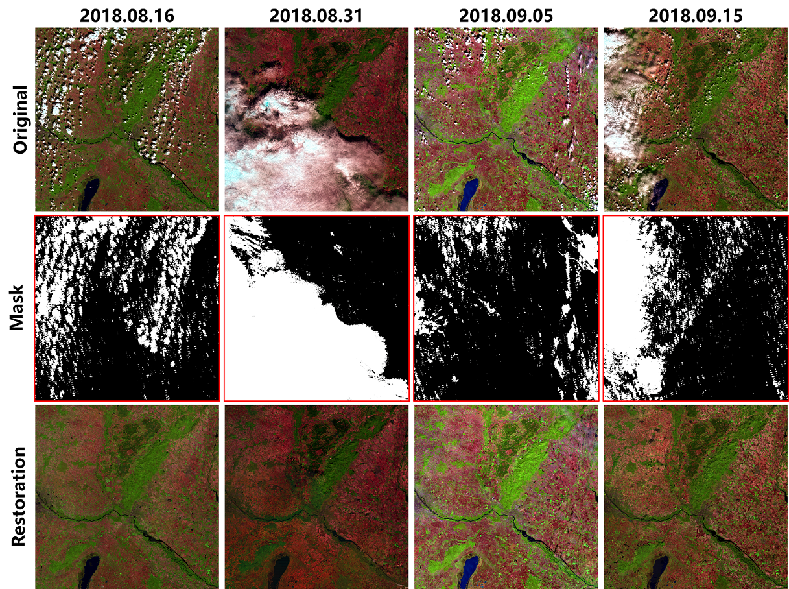

# PSTCR

Link: https://www.sciencedirect.com/science/article/pii/S0924271620300423

*__Codes of this work for cloud removal in multitemporal images.__*

Q. Zhang, Q. Yuan, J. Li, Z. Li, H. Shen, and L. Zhang, "__Thick cloud and cloud shadow removal in multitemporal images using progressively spatio-temporal patch group deep learning__", ***ISPRS Journal of Photogrammetry and Remote Sensing***, 2020.

Cloud and Shadow Removal Results for Multi-temporal Sequence Sentinel-2 MSI data: (**Full Width, 20m-Resolution**)

---------------   

Qiang Zhang,

Wuhan University.

E-mail: whuqzhang@gmail.com

Homepage: http://www.escience.cn/people/qz/index.html
